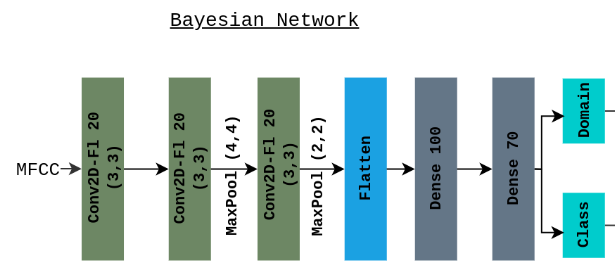

# Domain-Generalization-Experiments

There are three algorithms experimented in this project they are as follows:
1. Empirical Risk Minimization [Vapnik 1998](https://support.west-wind.com](https://www.wiley.com/en-fr/Statistical+Learning+Theory-p-9780471030034): The term empirical implies that we minimize our error based on a sample set S from the domain set X. Looking at it from a probabilistic perspective we say that we sample S from the domain set X, with D being the distribution over X. So when we sample from the domain, we express how likely a subset of the domain is sampled from the domain X by D(S).
2. Multitask Bayesian Network [Dissanayake, Theekshana](https://arxiv.org/pdf/2011.06207.pdf): 
3. Convolution Neural Network [Ballas, Aristotelis](https://arxiv.org/pdf/2208.09656.pdf)
